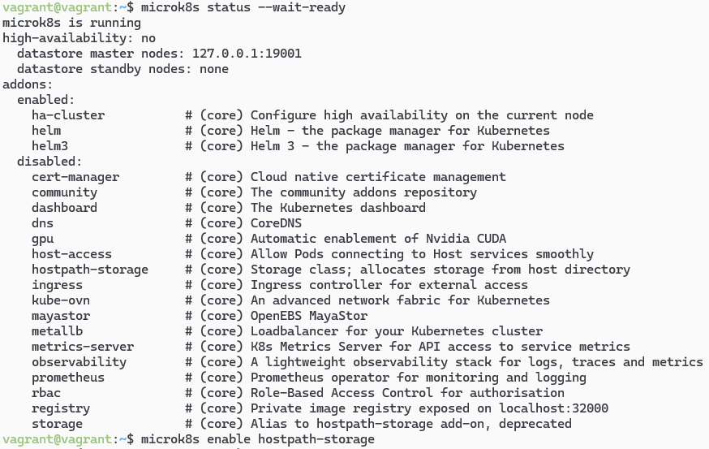
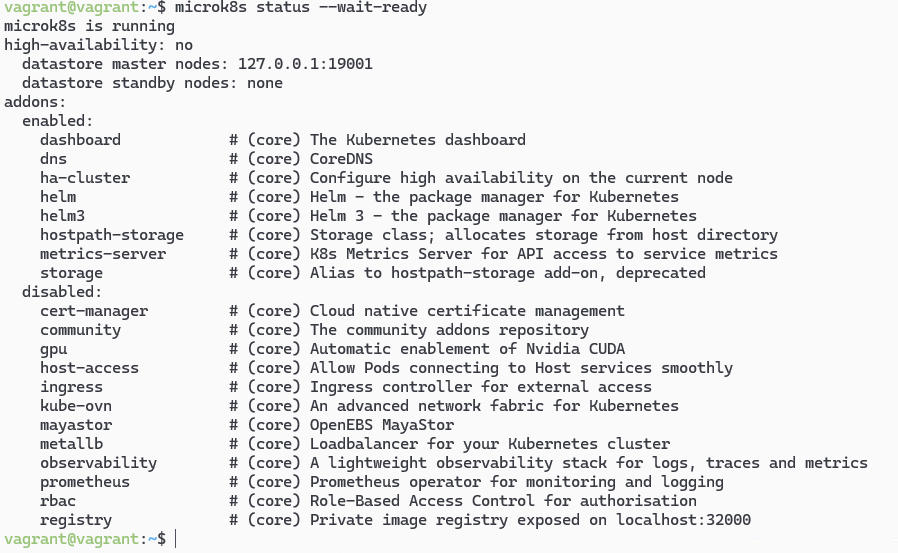
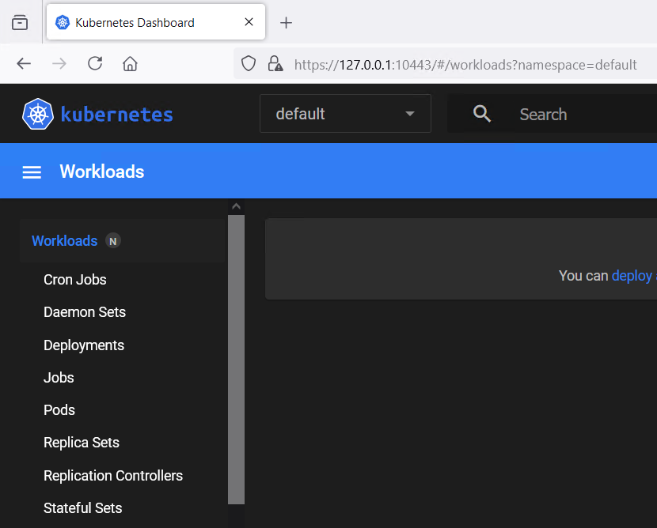
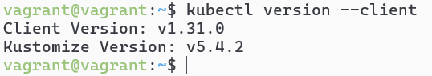
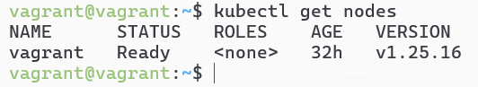
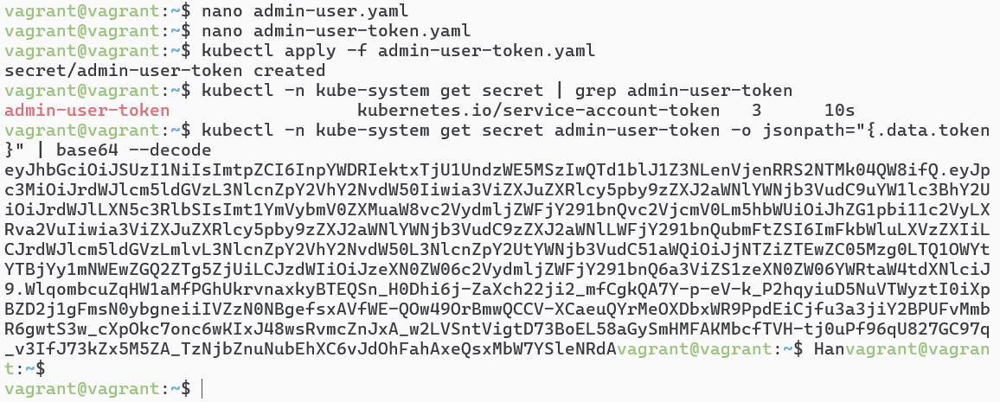
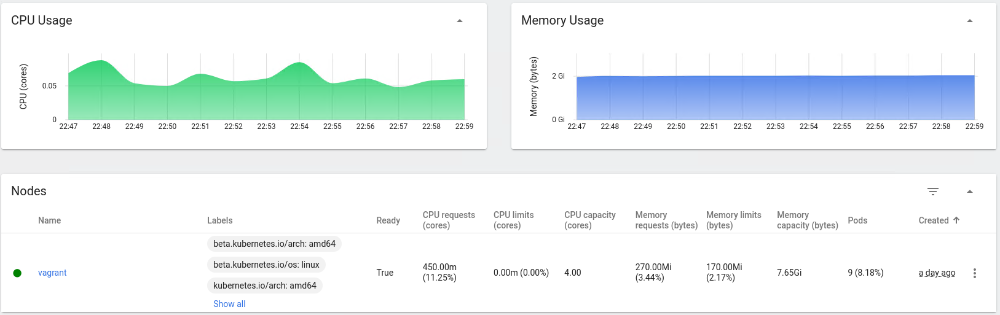

# Домашнее задание к занятию «Kubernetes. Причины появления. Команда kubectl» - Михалёв Сергей

### Цель задания

Для экспериментов и валидации ваших решений вам нужно подготовить тестовую среду для работы с Kubernetes. Оптимальное решение — развернуть на рабочей машине или на отдельной виртуальной машине MicroK8S.

------

### Задание 1. Установка MicroK8S

1. Установить MicroK8S на локальную машину или на удалённую виртуальную машину.
2. Установить dashboard.
3. Сгенерировать сертификат для подключения к внешнему ip-адресу.

**Решение**

Установил MicroK8S 
 

Установил dashboard 
 
В браузере 
 

------

### Задание 2. Установка и настройка локального kubectl
1. Установить на локальную машину kubectl.
2. Настроить локально подключение к кластеру.
3. Подключиться к дашборду с помощью port-forward.

**Решение**

Установил на вторую локальную машину kubectl 
 
Проверил подключение 
 
Создал пользователя с правами, достаточными для работы с дашбордом 
 
Дашборд 
 

------

